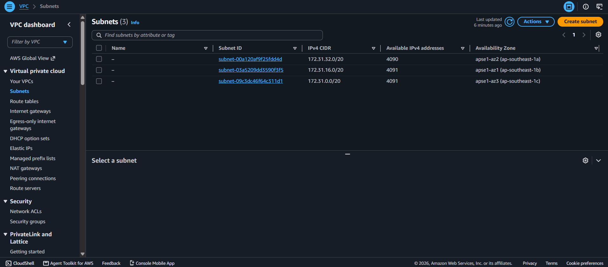
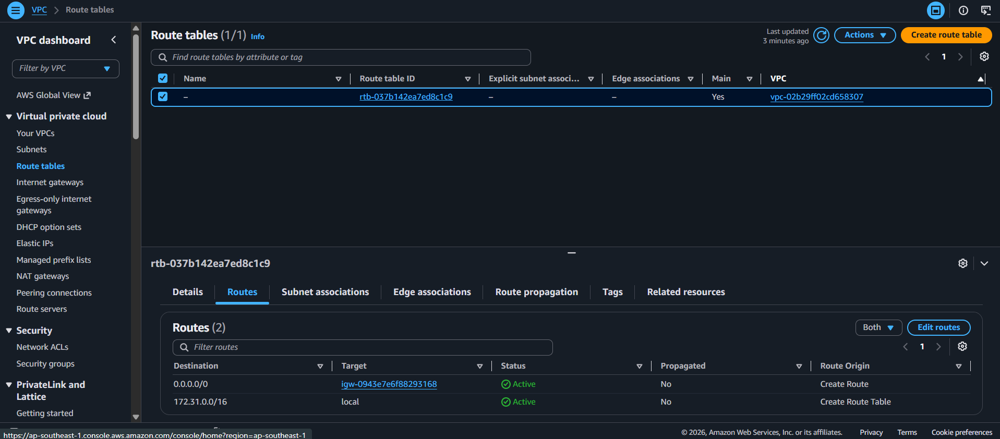
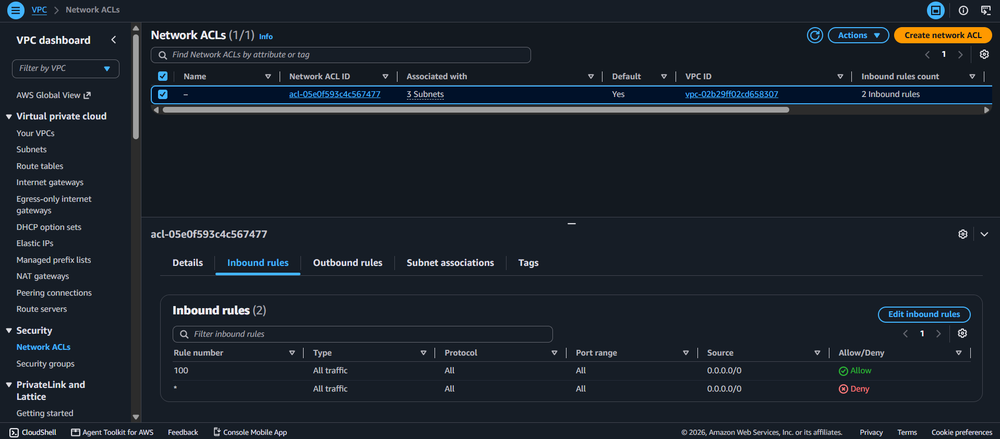
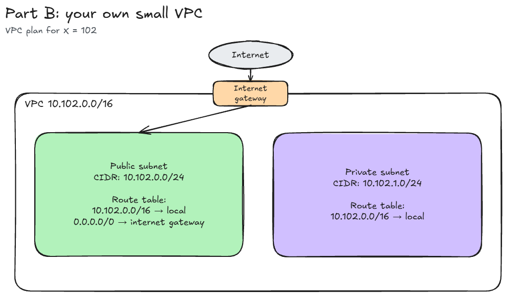

# Assignment 2 Submission

## About me

- GitHub username: Rengokunn
- Section: IV-ACSAD
- IAM user name that I signed in with: acsad-g05
- X: 102

---

## Part A. Explore

### A1. The VPC

Default VPC IPv4 CIDR:

`172.31.0.0/16`

Number of addresses in that CIDR:

65,536. A /16 block fixes 16 of the 32 bits and leaves 16 bits free, so it holds 2^16 = 65,536 addresses.

### A2. The subnets

| Availability Zone | IPv4 CIDR |
| --- | --- |
| `ap-southeast-1a` | `172.31.32.0/20` |
| `ap-southeast-1b` | `172.31.16.0/20` |
| `ap-southeast-1c` | `172.31.0.0/20` |

Screenshot 1. Save it as `screenshot-1-subnets.png` in your folder. The image line below shows it.

### A3. Available addresses

Available IPv4 addresses in each subnet:

`ap-southeast-1a` has 4,090, while `ap-southeast-1b` and `ap-southeast-1c` each have 4,091.

Why is the number lower than 4,096?

Each subnet is a /20, so it has 2^12 = 4,096 addresses in total. However, AWS keeps 5 addresses in every subnet for itself: the first four and the last one. Instances cannot use them. Therefore, an empty subnet shows 4,096 - 5 = 4,091 available addresses.

What uses the missing address in the subnet with the lowest number?

The subnet with the lowest number is `ap-southeast-1a`, which shows 4,090. That is one less than the other two, so one more address is already taken there. An address in a subnet is held by a network interface, so I believe it belongs to the network interface of an EC2 instance from the class labs. Even a stopped instance keeps its address, which means it would still be counted.

### A4. The route table

| Destination | Target |
| --- | --- |
| `172.31.0.0/16` | `local` |
| `0.0.0.0/0` | `igw-...` |

The first route is the local route, which connects all the subnets inside the VPC. The second route sends every other destination to the internet gateway. This is the main route table of the default VPC, and the three subnets use it.

Screenshot 2. Save it as `screenshot-2-routes.png` in your folder. The image line below shows it.

### A5. Public or private

Are the default subnets public or private? Which route proves it?

The default subnets are public. The route `0.0.0.0/0` sends traffic to the internet gateway (`igw-...`), and a subnet is public when its route table has this kind of route. Since all three default subnets use this route table, all of them are public. The name of a subnet does not matter here, only its route.

### A6. The internet gateway

State of the internet gateway:

Attached

What happens to the default subnets if the gateway is detached?

If the gateway is detached, the route `0.0.0.0/0` no longer has a working target. As a result, the subnets lose their path to the internet in both directions. Instances with public IP addresses could not be reached from outside, and they could not reach out either. Traffic inside the VPC would still work, however, because the local route `172.31.0.0/16` stays in the route table.

### A7. NAT gateways

Number of NAT gateways:

0

Can a server in a new private subnet download updates? Why?

No, it cannot. A new private subnet would use a route table with only the local route, so it has no path to the internet. The console shows no NAT gateways, which means there is nothing for a route `0.0.0.0/0` to point to. A server there could download updates only after a NAT gateway is created in a public subnet and the private route table sends `0.0.0.0/0` to it. Even then, the server would only start connections going out, and nobody on the internet could start a connection coming in.

### A8. The network ACL

| Rule number | Source | Allow or Deny |
| --- | --- | --- |
| 100 | `0.0.0.0/0` | Allow |
| `*` | `0.0.0.0/0` | Deny |

How is a network ACL different from a security group?

A network ACL protects a whole subnet, while a security group protects a single resource such as an instance. A network ACL is also stateless, so the reply traffic needs its own rule in the other direction, and it can have deny rules. In contrast, a security group is stateful and has allow rules only. In this network ACL, rule 100 allows all inbound traffic, and AWS checks rules from the lowest number first. Because of that, the `*` deny rule is never reached.

Screenshot 3. Save it as `screenshot-3-network-acl.png` in your folder. The image line below shows it.

### A9. The default security group

Inbound rule (type and source):

All traffic, from `sg-...`. The source is the `default` security group itself.

Which resources can send traffic to an instance that uses it?

Only resources that also use the `default` security group can send traffic to it. The source of the rule is the group itself, and there is no other inbound rule. Since a security group blocks everything that no rule allows, traffic from the internet and from resources in other security groups is blocked.

---

## Part B. Prepare

### B1. Plan two subnets

- Public subnet CIDR: `10.102.0.0/24`
- Private subnet CIDR: `10.102.1.0/24`

The VPC is `10.102.0.0/16`. The public subnet starts at the first address of the VPC, `10.102.0.0`, and as a /24 it ends at `10.102.0.255`. Therefore, the private subnet starts right after it, at `10.102.1.0`.

### B2. Route tables

Route table of the public subnet:

| Destination | Target |
| --- | --- |
| `10.102.0.0/16` | `local` |
| `0.0.0.0/0` | `internet gateway` |

Route table of the private subnet:

| Destination | Target |
| --- | --- |
| `10.102.0.0/16` | `local` |

### B3. My VPC diagram

Tool used (Excalidraw, draw.io, Lucidchart, or paper):

Excalidraw

Save your diagram as `vpc-diagram.png` in your folder. The image line below shows it.

### B4. Predict a change

Can you still open the web page from your laptop? Why?

No, I could not open it anymore. The route `0.0.0.0/0` is the one that sends internet traffic to the internet gateway. Without it, the subnet has no path for traffic going to and coming from my laptop, so the page would not load. The instance still has a public IP address, but an address alone is not enough without a route.

Can the instance still reach another instance in the VPC? Why?

Yes, it still can. Only the route `0.0.0.0/0` was deleted, so the local route `172.31.0.0/16` is still in the route table. This route connects all the subnets in the VPC, which means traffic between instances inside the VPC is not affected.

### B5. Place a database

Which subnet gets the database? Why?

The database goes in the private subnet, `10.102.1.0/24`. Its route table has no route to the internet gateway, so nobody on the internet can reach the database directly. At the same time, resources inside the VPC, such as a web server in the public subnet, can still reach it through the local route.

### B6. My question about VPCs

What is your question, and what made you think of it?

All the lab groups in the class use the same default VPC and the same three subnets, and the security group list showed many groups from other teams. Can an instance of one group reach an instance of another group in this VPC, and what stops it? I thought of this because the local route connects every subnet, while the default security group only accepts traffic from itself.
