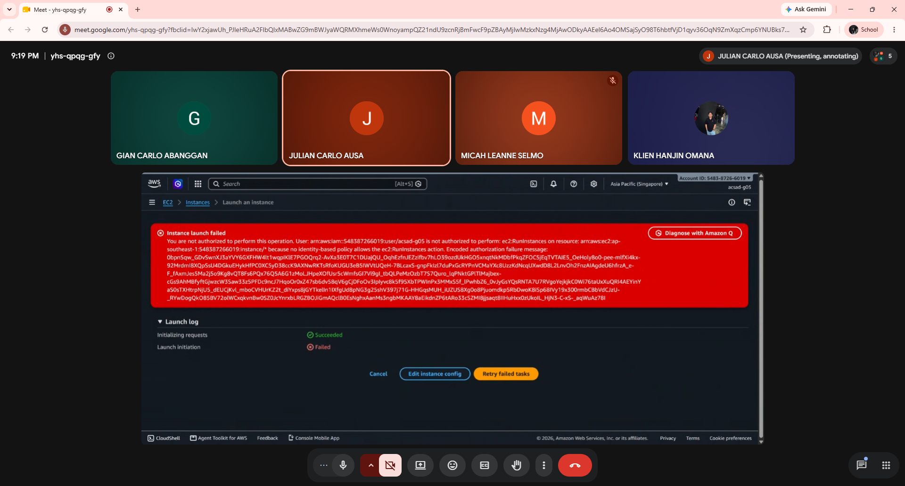
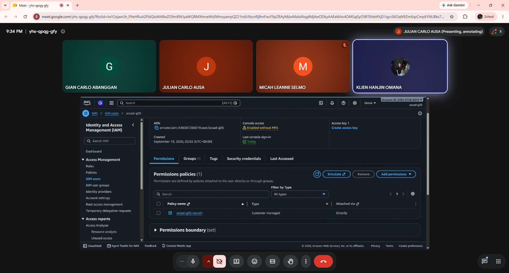
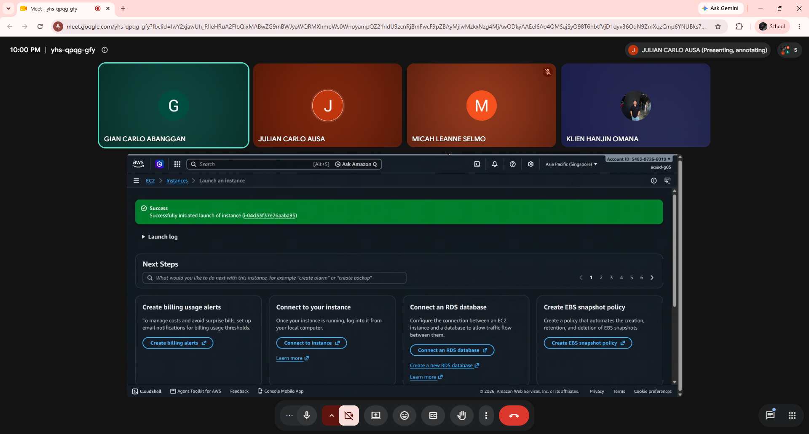
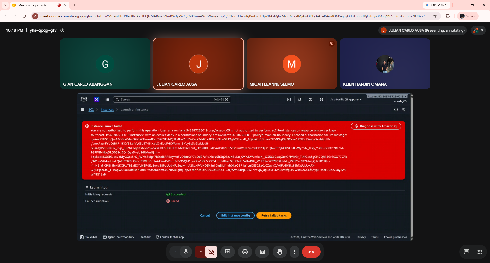
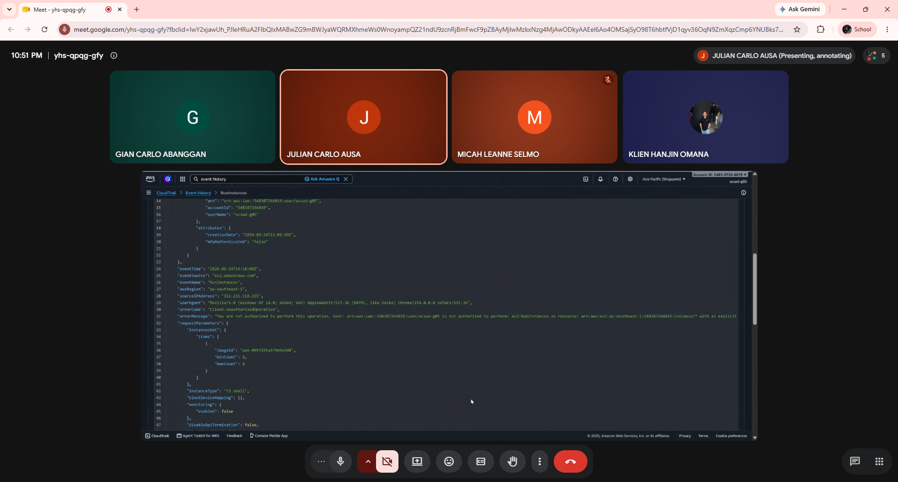

# Submission — Lab 1: Write and Attach an IAM Policy

**Team:** acsad-g05
**IAM user:** acsad-g05
**Account ID:** `548387266019`

---

## Part A — Sign-in and setup

- Region confirmed as Asia Pacific (Singapore) `ap-southeast-1`.
- Reviewed `umak-lab-t0-observe` (no `ec2:RunInstances` allowed).
- Reviewed `umak-lab-boundary`, statement `DenyAnyInstanceTypeButT3Micro`.

---

## Part B — Launch denial

**Error text (full):**

```
Instance launch failed
You are not authorized to perform this operation. User: arn:aws:iam::548387266019:user/acsad-g05 is not authorized to perform: **ec2:RunInstances** on resource: arn:aws:ec2:ap-southeast-1:548387266019:instance/* because no identity-based policy allows the ec2:RunInstances action. Encoded authorization failure message: 0bpnSqw_GDvSwnXJ3aYVY6GXFHW4lt1wqpIKlE7PGOQrq2-AvXa3E0T7C1DUajQU_OqhEzfnJEZzifbv7hLO39ozdUkHGO5xnqtNkMDbfPkqZFOC5jEqTVTAIE5_OeHoly8o0-pee-mlfXi4kx-92MrdmI8XQpSsU4DGkuEHykHfPC0XC5yD38ccK9AXNwRKTsRfoKUGU3eB5IWVtUQeH-7BLcaxS-gnpFkIzl7duPxGcRYPnVCMaYXc8UzzKdNcqUXwdD8L2LnvOh2FnzAIAgdeU6hfrzA_e-F_fAxmJes5Ma2j5o9Kg8vQT8Fs6PQx76Q5A6G1zMoLJHpeXOfUsr5cWmfsGI7Vi9gI_tbQLPeMzOzbT7S7Quro_lqPNktGPlTlMajbex-cGs9AhMBfyftGjwzcW3Saw33z5PFDc9ncJ7HqoOr0xZ47sb6dv58qV6gCjDFoOv3IpIyvc8k5f95XbTPWInPx3MMxS5f_lPwhbZ6_0vJyGsYQsRNTA7U7RVgoYejkjkC0Wi76taUxXuQRI4AEYinYaS0sTXHtrpNjU5_dEUCjKvl_mboCVHUrKZ2t_diYxps8jGYTkelIn1IXfgUd8pNG3g25shV397j71G-HHGqsMUH_iUZUS8Xg0o8Pjuomdkp5RbDwoK8iSp68IVy19x300rmbCBbVdCJzU-_RYwDogQkO85BV72olWCxqkvnBw0SZ0JcYnrxbLRGZBOJiGmAQclB0EsNghxAanMs3ngbMKAAY8aEikdnZP6tARo33cSZMI8jjsaqt8IIHuHxx0zUkoIL_HjN3-C-xS-_aqWuAz78I
```

Action named: **`ec2:RunInstances`**

**Screenshot 1 — launch error, username visible:**



---

## Part C — Policy blanks

| Blank | Value used |
| --- | --- |
| `"Action": "____"` | `ec2:RunInstances` |
| `"Resource": ".../____/*"` | `instance` (→ `.../instance/*`) |
| `"ec2:InstanceType": "____"` | `t3.micro` |

Policy name: `acsad-g05-launch`

---

## Part D — Attach and launch

**Security group creation error (no tag):**

```
You are not authorized to perform this operation. User: arn:aws:iam::548387266019:user/acsad-g05 is not authorized to perform: ec2:CreateSecurityGroup on resource: arn:aws:ec2:ap-southeast-1:548387266019:security-group/* because no identity-based policy allows the ec2:CreateSecurityGroup action. Encoded authorization failure message: aNtTeFRBbAKrPrYcQ1Dgj86sBHZSTdGuWUvOfynkuz12QtqAKq26wQ26IpRwlZBGu3YUS0bp7fit7t5-_quqlZrHiSFpXr46ewHcsZEPuW65NO21y_0-a2IPXSKdX6F2F0e46jeu2QCU5xra3pjk__uK1XFDLbQEzDS376I1r4rdTH9v75Q75XPl_oGHVIX9gJG0La8FtrfGNPiys1ancoNh81rtSqeLH2AJr3SEofsNUlSwIJ8eoqehYSjpf-0I-HTvXgFiFIXN0VZgXm1vqdKa-W7u1VgJiZ64ay_yV6dlCLqsmnU73HcPnyuHQRe47j8JrXXlIoPNFHTRvbfagIzi8Bgz3dsTz3RvaUGw0VzmqHqdJy-JL0X7iuNA9GN1O3tHgUPUJzr0YJNIZutiehU2-Ww7fgeFBU8j2S0N3T5w2XYduBLP6Xyc59gOcPwDbW9bI9Yk6MkdIBOOuL_y8biYXtWRtu0EpSq-glnObzrJpBpj9pS0F5Q7hLALrjLScFZxfWRDcs_97dXzfxNadkRa9nyOfvrVbkEDHgqI2Q
```

**Additional error hit while configuring the security group (egress rule):**

```
You may be missing IAM policies that allow RevokeSecurityGroupEgress. You are not authorized to perform this operation. User: arn:aws:iam::548387266019:user/acsad-g05 is not authorized to perform: ec2:RevokeSecurityGroupEgress on resource: arn:aws:ec2:ap-southeast-1:548387266019:security-group/sg-08682869082c6aa0d because no identity-based policy allows the ec2:RevokeSecurityGroupEgress action. Encoded authorization failure message: yOzTpG07qjr1oO2tluB4qjB0DNDwvoqMbgNtCg3VZncW64SPQLyeuNHacIyOLMZl0GozhGvusgMohT1WUqnsUrhRbqimQdxfOnpRrJJy4Hkg3umiTBUa-X7ZsGokLI0B3J02pofEMX47tnFC30yGGK5KQQxR9bC-lNtFWsN-t8mJASxISRErtA_acn2npUdNHfh77lh6YV4ZzPQzgxuLprL-oMxurLTKHLmFtLpINitW24d7Izn43DhNZpT1d1pwyd93TCusGAKD-qXFGI1vTJ8mCaW26P9zQhiz6msDZ4zmwYdxVjkOod5csQLMrOGKF68xRa-tltCbUEkHetT6G-x6e7OdthOGp_CpCVOvyX8FUfV8YfyE0b8O8ZbbaIKWxRM-Jsnto_STNmlOJBujnUf-mAZxgJlPdZmDGipwACkwv23uOUGkWo7LCRpZWH0QjTJGVsYr54Nk4mhNp79zdS5UvySRlTPUoUjWr0ASg7znafqISPM03UF_sKPC5o1WFxo0xk5KBcwu5WmLq8UHEiP28IUpvtCUncX4VFvqEE7Or7wEpZoy-er9btrrCeFENO31PH3bxpbJQTeItK3wIz0319nS0bVhfPqYHqMkTUPHnVMcbZL7cDIEaKtDCo0LlJ7vQZGc
```

**Screenshot 2 — Permissions tab listing `acsad-g05-launch`:**



*(Captured 9:34 PM — Permissions policies shows `acsad-g05-launch`, Customer managed, attached Directly.)*

**Screenshot 3 — instance launch success:**



**Time instance entered Running state:** 10:00 PM (PHT / UTC+08:00) — instance ID `i-04d33f37e76aaba95`.

---

## Part E — Boundary test

**`t3.small` denial error:**

```
Instance launch failed
You are not authorized to perform this operation. User: arn:aws:iam::548387266019:user/acsad-g05 is not authorized to perform: ec2:RunInstances on resource: arn:aws:ec2:ap-southeast-1:548387266019:instance/* with an explicit deny in a permissions boundary: arn:aws:iam::548387266019:policy/umak-lab-boundary. Encoded authorization failure message: owhWHgYS-TreOyot_uecgSDEpjDuRtpKw5F6-ewQUlI6mmV_GhMs2LZB9ePcv7tv1f8EumVRSTciOSLYIY1ohQhwzi0rR-40m-Uwcr_2_2e4H7rjcZ8d4lPdwaKx34zEuhfTKdxNQYRYBXvO0uKH8zKXScVTrD82pRL11AzmJ3tcy7k-T1cEiNymmhdQyMmOXdgpQwi-hAhkPXzpxJp4DcvASXi8t5PQym3XUs0n9Ob3K1WWxqXppYWuUSnHiFr5s9xNbA1YGoKM9Jov4rXSX8Tv9Zc4ONEjeW0kuFtlFr7nFdMYrbiiFlEyRrm9E0GxhktCSaQm0wRr-OKboq628_025NHRHrSVG4E978hmxTWNiTaMnOA421GIAH7fYJXF_Hmzvy4TWQfDm5iQ1mfjYpQ9l_cCDafbrffAZtmtTj1fbBwBsG6K62ZTzW6hiRzZAqZEeejNy7LYNcPwT34eMybff0Ej5aRGx8buNSfwm4EYriECRx66pEXRlpLsNJvvCE4eMAvvXfk6QN0NKaDnBf6u0z9SaNm71XTMQtr7-fFarB9hu-3KB7BRYjQu422J1JtY7Eny8HTydZPl-T5YFXdk0idt3lEzAWzozkeBXj33j3fXho5q3v09Q-o2Izs7HwsqCAJbH5qjtYI-b79EEau8Auw77yDeRiGG_k-0iXPTDE0Lb2fxsF1xwwE39HutaQCtwPSu11gh7egWPconY3vdEiDpdf8QiMVlacR10rHFBUSx4lZBf5LxfIy1FFmAkQyRAw-kTAVPCi7otIgmIcCs-5Nd2ouWS0LZjq0Sn9EMbAtta7wsMDG_ZVLuIPY0fNdYuPInGomL1Q-LAMnJIiG0CcOPUOZb616VXTKyf7Vort0-_T5dIOlNPI_cs5RV3u9gj1L1j8VAmAHoT3whRphaOQNqi4DZLHJmVJHtrppQko6yT-KXm4FZO_98lYlB
```

**Tokyo region denial (explicit deny outside Singapore):**

```
Exception while fetching data (/Resources/EC2_Instances) : software.amazon.awssdk.services.ec2.model.Ec2Exception: You are not authorized to perform this operation. User: arn:aws:iam::548387266019:user/acsad-g05 is not authorized to perform: ec2:DescribeInstances with an explicit deny in a permissions boundary: arn:aws:iam::548387266019:policy/umak-lab-boundary (Service: Ec2, Status Code: 403, Request ID: bf1507be-a787-4eb8-b875-80933da17d95) (SDK Attempt Count: 1)
```

**Screenshot 4 — `t3.small` denial (explicit deny in a permissions boundary):**



*(Captured 10:18 PM.)*

**`acsad-g05-too-wide` cleanup:**

- Detached from user: yes
- Deleted as a policy: yes
- Notes: Delete initially returned an "Unexpected error" in the console. Confirmed the policy was already detached ("Used as: None"), waited ~30 seconds, refreshed the Policies page, and retried — the delete succeeded on the retry.

**Screenshot 5 — CloudTrail event showing `errorMessage`:**



*(Captured 10:51 PM — CloudTrail → Event history → RunInstances event, `errorCode: Client.UnauthorizedOperation`, `awsRegion: ap-southeast-1`, `instanceType: t3.small`, `errorMessage` field visible confirming the explicit deny.)*

---

## Part F — Questions

1. **Which action did the Part B error name?**

   `ec2:RunInstances`. The starter policy we're given, `umak-lab-t0-observe`, only lets us view resources, not create them. Since it has no statement allowing `RunInstances` at all, the launch fails immediately, before our own policy from Part C even exists.

2. **In your policy, which condition limits `ec2:RunInstances`?**

   The `StringEquals` condition inside `RunOnlyT3MicroInstances`, which checks that `ec2:InstanceType` equals `t3.micro`. This is what stops our policy from being an unconditional allow. Without it, granting `RunInstances` would let us launch any instance type at all. With it, the allow only applies when the request specifically matches `t3.micro`, so anything else gets treated as if we never had permission to begin with.

3. **After you attached `ec2:*` on `*`, why was `t3.small` still denied? Name the boundary statement.**

   Because a permissions boundary sits above anything our own identity policy grants, and it caps what we can ever be allowed to do, no matter how broad our policy is. `umak-lab-boundary` contains an explicit deny, `DenyAnyInstanceTypeButT3Micro`, and in IAM's evaluation logic, an explicit deny always overrides an allow, from any policy, anywhere in the chain. So attaching `ec2:*` doesn't help, since the boundary was never checking what our policy permits — it's checking what the account itself will tolerate.

4. **Why is `ec2:*` on `*` a poor policy even with a boundary?**

   Because the boundary is narrow and specific — it only restricts instance type and region here. It says nothing about security groups, volumes, snapshots, or any other EC2 action. A policy of `ec2:*` on `*` grants every one of those, everywhere, and the boundary simply doesn't cover most of it. So even though the boundary blocks the two things it was built to block, the policy itself is still bad practice: it hands out access far beyond what the task needs, and the boundary isn't a substitute for writing a tight policy in the first place.

5. **In two sentences: what does the boundary control that your policy cannot?**

   The boundary sets a fixed ceiling at the account level on what any policy is ever allowed to grant us, and that ceiling doesn't move no matter what we attach afterward. Our own policy can only restrict permissions further within that ceiling, never exceed it, which is exactly why `t3.small` and the Tokyo region stayed blocked even once we'd attached `ec2:*`.

---

## Required screenshots checklist

| # | What | Part | Filename |
| --- | --- | --- | --- |
| 1 | Launch denial, username visible | B | `part-b-error.png` |
| 2 | Permissions tab listing `acsad-g05-launch` | D | `part-d-policy.png` |
| 3 | Instance launch success | D | `part-d-instance.png` |
| 4 | `t3.small` denial (permissions boundary) | E | `part-e-denial.png` |
| 5 | CloudTrail event showing `errorMessage` | E | `part-e-cloudtrail.png` |
